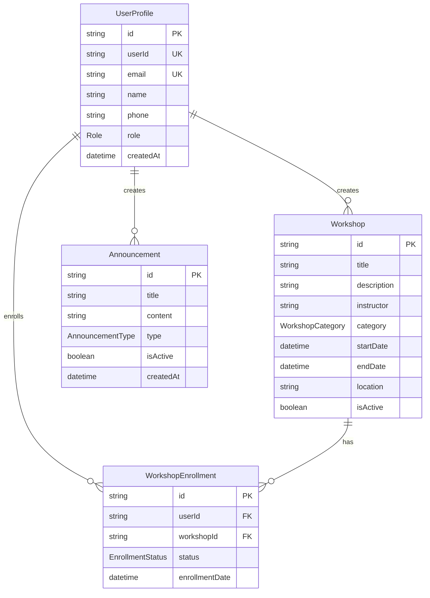
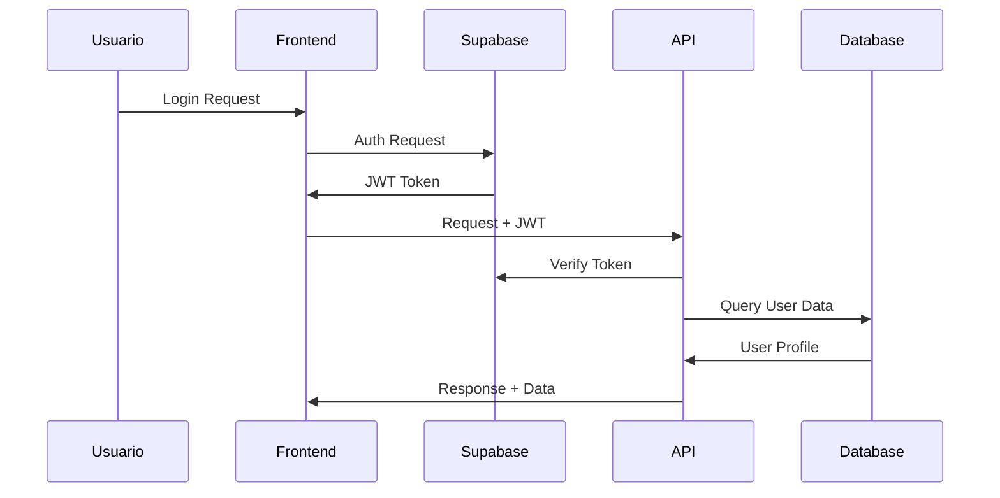
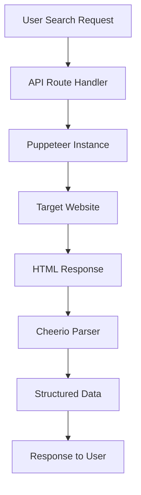

# Arquitectura del Sistema - Biblioteca Valdivia

## Tabla de Contenidos
1. [Resumen Ejecutivo](#resumen-ejecutivo)
2. [Arquitectura General](#arquitectura-general)
3. [Stack Tecnológico](#stack-tecnológico)
4. [Estructura del Proyecto](#estructura-del-proyecto)
5. [Patrones de Diseño](#patrones-de-diseño)
6. [Base de Datos](#base-de-datos)
7. [APIs y Servicios](#apis-y-servicios)
8. [Autenticación y Autorización](#autenticación-y-autorización)
9. [Integración con Sistemas Externos](#integración-con-sistemas-externos)
10. [Justificación de Decisiones Arquitectónicas](#justificación-de-decisiones-arquitectónicas)

---

## Resumen Ejecutivo

**Biblioteca Valdivia** es una aplicación web moderna que combina la gestión de recursos bibliotecarios con funcionalidades de búsqueda externa de libros mediante web scraping. El sistema está construido como una aplicación monolítica utilizando Next.js con App Router, proporcionando tanto el frontend como las APIs backend en una sola aplicación cohesiva.

### Características Principales
- **Gestión de Usuarios**: Sistema completo de autenticación y perfiles de usuario
- **Talleres/Workshops**: Plataforma para crear, gestionar e inscribirse en talleres
- **Sistema de Anuncios**: Comunicación efectiva con los usuarios
- **Búsqueda de Libros**: Web scraping inteligente para búsqueda externa de libros
- **Panel Administrativo**: Gestión completa del sistema para administradores

---

## Arquitectura General

### Patrón Arquitectónico: Monolito Modular

```
┌─────────────────────────────────────────────────────────────┐
│                    NEXT.JS APPLICATION                      │
├─────────────────────────────────────────────────────────────┤
│  Frontend (React 19 + TypeScript)                          │
│  ├── Pages (App Router)                                    │
│  ├── Components (React + Material-UI)                      │
│  └── State Management (React Context)                      │
├─────────────────────────────────────────────────────────────┤
│  Backend APIs (Next.js API Routes)                         │
│  ├── Authentication APIs                                   │
│  ├── Workshop Management APIs                              │
│  ├── User Management APIs                                  │
│  ├── Announcements APIs                                    │
│  └── Web Scraping APIs                                     │
├─────────────────────────────────────────────────────────────┤
│  Data Layer                                                │
│  ├── Prisma ORM                                           │
│  ├── Database Schemas                                      │
│  └── Migration System                                      │
└─────────────────────────────────────────────────────────────┘
                              │
                              ▼
┌─────────────────────────────────────────────────────────────┐
│              EXTERNAL INTEGRATIONS                          │
├─────────────────────────────────────────────────────────────┤
│  Supabase (Authentication & Storage)                       │
│  PostgreSQL Database                                        │
│  External Book Sources (Web Scraping)                      │
└─────────────────────────────────────────────────────────────┘
```

### Ventajas de esta Arquitectura
1. **Desarrollo Rápido**: Un solo repositorio, un solo deployment
2. **Simplicidad Operacional**: Menor complejidad de infraestructura
3. **Consistencia**: Tipos compartidos entre frontend y backend
4. **Performance**: Optimizaciones de Next.js (SSR, ISR, Edge functions)

---

## Stack Tecnológico

### Frontend
- **Next.js 15.5.2**: Framework React con App Router para routing moderno
- **React 19.1.0**: Biblioteca de UI con las últimas características
- **TypeScript 5**: Tipado estático para mayor robustez
- **Material-UI 7.3.2**: Sistema de componentes moderno y accesible
- **Tailwind CSS 4**: Framework CSS utility-first para estilos eficientes
- **Framer Motion 12**: Animaciones fluidas y profesionales

### Backend
- **Next.js API Routes**: APIs RESTful integradas
- **Prisma 6.16.2**: ORM moderno para TypeScript
- **PostgreSQL**: Base de datos relacional robusta

### Autenticación y Seguridad
- **Supabase Auth**: Sistema de autenticación completo
- **Supabase SSR**: Manejo de sesiones server-side

### Web Scraping y Automatización
- **Puppeteer 24.19.0**: Control de navegador para scraping
- **Chromium**: Navegador headless optimizado
- **Cheerio 1.1.2**: Manipulación de DOM server-side
- **Axios 1.11.0**: Cliente HTTP para APIs externas

### Herramientas de Desarrollo
- **ESLint 9**: Linting y calidad de código
- **Turbopack**: Bundler ultra-rápido de Vercel

---

## Estructura del Proyecto

```
biblioteca-valdivia/
├── src/
│   ├── app/                          # App Router (Next.js 13+)
│   │   ├── (routes)/                 # Páginas públicas
│   │   │   ├── page.tsx              # Página principal
│   │   │   ├── buscar-libros/        # Búsqueda de libros
│   │   │   ├── actividades/          # Talleres disponibles
│   │   │   ├── contacto/             # Información de contacto
│   │   │   └── servicios/            # Servicios de la biblioteca
│   │   ├── auth/                     # Autenticación
│   │   │   ├── login/                # Inicio de sesión
│   │   │   └── register/             # Registro de usuarios
│   │   ├── dashboard/                # Panel de usuario
│   │   │   ├── page.tsx              # Dashboard principal
│   │   │   ├── admin/                # Panel administrativo
│   │   │   │   ├── users/            # Gestión de usuarios
│   │   │   │   ├── workshops/        # Gestión de talleres
│   │   │   │   └── announcements/    # Gestión de anuncios
│   │   │   └── profile/              # Perfil de usuario
│   │   ├── api/                      # API Routes
│   │   │   ├── auth/                 # APIs de autenticación
│   │   │   ├── users/                # APIs de usuarios
│   │   │   ├── workshops/            # APIs de talleres
│   │   │   ├── announcements/        # APIs de anuncios
│   │   │   ├── scrape-books/         # API de scraping
│   │   │   └── admin/                # APIs administrativas
│   │   └── layout.tsx                # Layout principal
│   ├── components/                   # Componentes reutilizables
│   │   ├── Header.tsx                # Navegación principal
│   │   ├── Footer.tsx                # Pie de página
│   │   ├── BookSearch.tsx            # Búsqueda de libros
│   │   ├── BookList.tsx              # Lista de libros
│   │   ├── LoadingScreen.tsx         # Pantallas de carga
│   │   └── MotionWrapper.tsx         # Wrapper de animaciones
│   ├── lib/                          # Utilidades y configuraciones
│   │   ├── prisma.ts                 # Cliente de Prisma
│   │   ├── supabase.ts               # Cliente de Supabase
│   │   └── supabase/                 # Configuraciones específicas
│   └── contexts/                     # Context providers
├── prisma/                           # Esquemas de base de datos
│   ├── schema.prisma                 # Definición del esquema
│   └── migrations/                   # Migraciones de DB
├── public/                           # Archivos estáticos
└── migrations/                       # Scripts SQL adicionales
```

### Principios de Organización

1. **Separación por Funcionalidad**: Cada módulo tiene su carpeta específica
2. **Colocation**: Archivos relacionados están próximos entre sí
3. **Convención sobre Configuración**: Siguiendo estándares de Next.js
4. **Escalabilidad**: Estructura preparada para crecimiento futuro

---

## Patrones de Diseño

### 1. App Router Pattern (Next.js 13+)
```typescript
// Estructura de rutas basada en carpetas
app/
├── page.tsx                    # / (raíz)
├── dashboard/
│   ├── page.tsx               # /dashboard
│   └── admin/
│       └── page.tsx           # /dashboard/admin
```

### 2. API Route Handlers
```typescript
// src/app/api/workshops/route.ts
export async function GET() {
  // Lógica de GET
}

export async function POST(request: Request) {
  // Lógica de POST
}
```

### 3. Repository Pattern con Prisma
```typescript
// Abstracción de acceso a datos
const prisma = new PrismaClient();

export const workshopRepository = {
  findAll: () => prisma.workshop.findMany(),
  findById: (id: string) => prisma.workshop.findUnique({ where: { id } }),
  create: (data: WorkshopCreateInput) => prisma.workshop.create({ data }),
};
```

### 4. Context Pattern para Estado Global
```typescript
// Gestión de estado de autenticación
export const AuthContext = createContext<AuthContextType | null>(null);
```

---

## Base de Datos

### Esquema Relacional



### Características del Diseño de BD

1. **Normalización**: Evita redundancia de datos
2. **Relaciones Claras**: FK bien definidas con CASCADE apropiados
3. **Enums Tipados**: Estados y categorías bien definidos
4. **Auditoría**: Campos de timestamps en todas las tablas
5. **Flexibilidad**: Campos JSON para preferencias extensibles

---

## APIs y Servicios

### Arquitectura RESTful

```
API Structure:
├── /api/auth/                    # Autenticación
├── /api/users/                   # Gestión de usuarios
│   └── /[id]/enrollments/        # Inscripciones de usuario específico
├── /api/workshops/               # Gestión de talleres
│   └── /[id]/enrollments/        # Inscripciones de taller específico
├── /api/announcements/           # Gestión de anuncios
├── /api/scrape-books/            # Web scraping de libros
├── /api/statistics/              # Estadísticas del sistema
└── /api/admin/                   # APIs administrativas
    ├── /users/                   # Administración de usuarios
    ├── /workshops/               # Administración de talleres
    └── /announcements/           # Administración de anuncios
```

### Estándares de API

1. **REST Principles**: Métodos HTTP semánticamente correctos
2. **Status Codes**: Códigos de respuesta HTTP apropiados
3. **Error Handling**: Manejo consistente de errores
4. **Validation**: Validación de entrada en todas las APIs
5. **CORS**: Configuración adecuada para acceso cross-origin

---

## Autenticación y Autorización

### Flujo de Autenticación



### Niveles de Autorización

1. **Public**: Acceso sin autenticación
2. **Authenticated**: Requiere usuario logueado
3. **Admin**: Requiere rol de administrador

### Implementación de Seguridad

```typescript
// Middleware de autenticación
export async function authenticate(request: Request) {
  const token = request.headers.get('authorization');
  const user = await supabase.auth.getUser(token);
  return user;
}

// Verificación de roles
export function requireAdmin(user: User) {
  if (user.role !== 'ADMIN') {
    throw new Error('Insufficient permissions');
  }
}
```

---

## Integración con Sistemas Externos

### 1. Supabase Integration

**Propósito**: Autenticación, autorización y storage
**Justificación**:
- Reduce complejidad de implementar auth desde cero
- Escalabilidad automática
- Seguridad enterprise-grade

```typescript
// Configuración de Supabase
const supabase = createClient(
  process.env.NEXT_PUBLIC_SUPABASE_URL!,
  process.env.NEXT_PUBLIC_SUPABASE_ANON_KEY!
);
```

### 2. Web Scraping System

**Propósito**: Búsqueda externa de libros en tiempo real
**Arquitectura**:



**Justificación**:
- **Puppeteer**: Control completo del navegador, manejo de JavaScript
- **Cheerio**: Parsing eficiente de HTML server-side
- **Chromium**: Navegador optimizado para headless operations

---

## Justificación de Decisiones Arquitectónicas

### 1. ¿Por qué Next.js 15 con App Router?

**Decisión**: Adoptar Next.js 15 con App Router en lugar de Pages Router

**Justificaciones**:
- **Performance Superior**:
  - Server Components reducen el bundle size del cliente
  - Streaming de componentes mejora la percepción de velocidad
  - Automatic code splitting por ruta

- **Developer Experience**:
  - Colocation de layouts y loading states
  - File-based routing más intuitivo
  - TypeScript integration mejorada

- **Futuro-proof**:
  - App Router es el futuro de Next.js
  - Mejor soporte para React 18+ features
  - Preparado para React Server Components

**Alternativas Consideradas**:
- Pages Router: Descartado por ser legacy
- Remix: Menos ecosistema, learning curve mayor
- Vite + React Router: Más configuración manual

### 2. ¿Por qué Arquitectura Monolítica?

**Decisión**: Monolito modular vs. Microservicios

**Justificaciones**:
- **Simplicidad Operacional**:
  - Un solo deployment
  - Una sola base de datos
  - Debugging más sencillo

- **Team Size**:
  - Equipo pequeño/mediano se beneficia de menor complejidad
  - Shared types entre frontend y backend

- **Performance**:
  - Eliminación de latencia de red interna
  - Transacciones ACID simples

**Escalabilidad**: Preparado para extraer servicios cuando sea necesario

### 3. ¿Por qué PostgreSQL + Prisma?

**Decisión**: PostgreSQL con Prisma ORM

**Justificaciones PostgreSQL**:
- **Robustez**: ACID compliance, reliable para datos críticos
- **Features Avanzadas**: JSON support, complex queries, indexes
- **Ecosystem**: Excelente soporte en hosting providers

**Justificaciones Prisma**:
- **Type Safety**: Generated types previenen errores en runtime
- **Developer Experience**: Intuitive query API, excellent tooling
- **Migration System**: Version control para esquemas de DB
- **Performance**: Query optimization automática

**Alternativas Consideradas**:
- MongoDB: Descartado por requerimientos relacionales
- TypeORM: Más verboso, menos type safety
- Raw SQL: Mayor complejidad de mantenimiento

### 4. ¿Por qué Material-UI + Tailwind?

**Decisión**: Hybrid approach con MUI y Tailwind

**Justificaciones Material-UI**:
- **Component Library**: Componentes complejos prediseñados
- **Accessibility**: WCAG compliance out-of-the-box
- **Theming**: Sistema de temas robusto
- **Consistency**: Design system coherente

**Justificaciones Tailwind**:
- **Flexibility**: Customización rápida de estilos
- **Performance**: Purging automático de CSS no usado
- **Developer Experience**: Utility-first approach

**Sinergia**: MUI para componentes complejos, Tailwind para layout y customización

### 5. ¿Por qué Supabase para Auth?

**Decisión**: Supabase Auth vs. implementación propia

**Justificaciones**:
- **Security**: Implementación battle-tested de OAuth, JWT
- **Features**: Social logins, MFA, password reset out-of-the-box
- **Compliance**: GDPR, SOC2 compliance automática
- **Time to Market**: Implementación en días vs. semanas
- **Maintenance**: Zero maintenance overhead para auth logic

**Costo vs. Beneficio**:
- Costo mensual predecible
- Eliminación de riesgo de seguridad
- Liberación de tiempo de desarrollo para features de negocio

### 6. ¿Por qué Web Scraping con Puppeteer?

**Decisión**: Puppeteer + Cheerio para búsqueda de libros

**Justificaciones**:
- **JavaScript Support**: Muchos sitios modernos requieren JS rendering
- **Control Completo**: Headers, cookies, user agents customizables
- **Reliability**: Manejo de timeouts, retries, error handling
- **Flexibility**: Adaptable a cambios en sitios target

**Consideraciones Éticas**:
- Rate limiting implementado
- Respeto por robots.txt cuando aplicable
- Uso exclusivo para búsqueda de información pública

### 7. ¿Por qué TypeScript Full-Stack?

**Decisión**: TypeScript en frontend y backend

**Justificaciones**:
- **Type Safety**: Prevención de errores en compile-time
- **Shared Types**: Interfaces compartidas entre FE y BE
- **Refactoring**: Cambios seguros y automáticos
- **Developer Experience**: IntelliSense, auto-completion
- **Team Collaboration**: Contratos claros entre desarrolladores

**ROI**: Menos bugs en producción, desarrollo más rápido a largo plazo

---

## Integración de Necesidades TI

### 1.1.4.9. Arquitectura TI y Necesidad de Integración

**Definición de la Arquitectura**:
El sistema utiliza una **arquitectura de aplicación web moderna tipo SPA (Single Page Application) con SSR (Server-Side Rendering) híbrido**, implementada a través de Next.js. Esta arquitectura permite:

- **Renderizado Mixto**: Server-side para SEO y performance inicial, client-side para interactividad
- **API Gateway Integrado**: Next.js API routes actúan como gateway para servicios externos
- **Estado Distribuido**: Combinación de server state (Prisma) y client state (React Context)

**Necesidades de Integración Identificadas**:

1. **Integración con Sistemas de Autenticación Externos**:
   - Supabase Auth para OAuth providers (Google, GitHub, etc.)
   - Preparado para integración con sistemas LDAP/Active Directory
   - Capacidad de SSO para futuras integraciones institucionales

2. **Integración con Sistemas de Búsqueda Externos**:
   - Web scraping APIs para múltiples fuentes de libros
   - Preparado para APIs de catálogos bibliotecarios (OPAC)
   - Potencial integración con WorldCat, Library of Congress

3. **Integración con Sistemas de Notificaciones**:
   - Email service providers (SendGrid, AWS SES)
   - SMS providers para notificaciones críticas
   - Push notifications para aplicaciones móviles futuras

4. **Integración con Sistemas de Analytics**:
   - Google Analytics para métricas de uso
   - Custom analytics dashboard para administradores
   - Business Intelligence tools (futuro)

### 1.1.4.10. Justificación de la Arquitectura TI Seleccionada

**Criterios de Evaluación**:

1. **Escalabilidad** ⭐⭐⭐⭐⭐
   - Horizontal scaling through Vercel/Netlify deployment
   - Database scaling through connection pooling
   - CDN integration para assets estáticos

2. **Mantenibilidad** ⭐⭐⭐⭐⭐
   - TypeScript para type safety
   - Modular architecture con clara separación de responsabilidades
   - Automated testing capabilities

3. **Seguridad** ⭐⭐⭐⭐⭐
   - OAuth 2.0 / OpenID Connect through Supabase
   - SQL injection prevention through Prisma ORM
   - HTTPS enforced, CORS properly configured

4. **Performance** ⭐⭐⭐⭐⭐
   - Server-side rendering para tiempo de carga inicial
   - Code splitting automático
   - Image optimization built-in

5. **Costo Total de Operación** ⭐⭐⭐⭐⭐
   - Serverless deployment reduce costos de infraestructura
   - Managed services (Supabase, Vercel) reducen overhead operacional
   - Open source stack reduce licensing costs

**Comparación con Alternativas**:

| Criterio | Next.js (Seleccionado) | Laravel + Vue | .NET Core + React | Django + React |
|----------|------------------------|---------------|-------------------|----------------|
| Time to Market | ⭐⭐⭐⭐⭐ | ⭐⭐⭐ | ⭐⭐ | ⭐⭐⭐ |
| TypeScript Support | ⭐⭐⭐⭐⭐ | ⭐⭐ | ⭐⭐⭐⭐⭐ | ⭐⭐ |
| Hosting Options | ⭐⭐⭐⭐⭐ | ⭐⭐⭐ | ⭐⭐⭐⭐ | ⭐⭐⭐ |
| Learning Curve | ⭐⭐⭐⭐ | ⭐⭐⭐ | ⭐⭐ | ⭐⭐⭐ |
| Community/Ecosystem | ⭐⭐⭐⭐⭐ | ⭐⭐⭐⭐ | ⭐⭐⭐⭐ | ⭐⭐⭐⭐ |

**Decisión Final**: Next.js fue seleccionado por su **balance óptimo entre productividad, performance y costo**, especialmente considerando el contexto de una biblioteca pública que requiere maximizar el valor con recursos limitados.

---

## Roadmap de Evolución Arquitectónica

### Fase Actual (V1.0) - Monolito Inteligente
- ✅ Aplicación Next.js completa
- ✅ Base de datos PostgreSQL centralizada
- ✅ Autenticación via Supabase
- ✅ Web scraping básico

### Fase 2 (V2.0) - Optimización y Extensión
- 🔄 Cache layer con Redis
- 🔄 Background jobs con Queue system
- 🔄 Email service integration
- 🔄 Mobile-responsive PWA

### Fase 3 (V3.0) - Microservicios Selectivos
- 📋 Extraction del servicio de scraping
- 📋 Notification service independiente
- 📋 Analytics service dedicado
- 📋 Media/file storage service

### Consideraciones para la Evolución
- **Triggers para Migration**: Carga de usuarios, performance bottlenecks
- **Backwards Compatibility**: Mantener APIs estables
- **Data Migration Strategy**: Plan detallado para división de servicios

---

## Conclusiones

La arquitectura implementada para **Biblioteca Valdivia** representa una solución **equilibrada y pragmática** que prioriza:

1. **Velocidad de Desarrollo**: Stack moderno con excelente DX
2. **Robustez**: Tecnologías battle-tested en producción
3. **Escalabilidad**: Preparado para crecimiento futuro
4. **Mantenibilidad**: Código limpio y bien estructurado
5. **Costo-Efectividad**: Maximiza valor con recursos limitados

Esta arquitectura **no es solo técnicamente sólida, sino estratégicamente alineada** con los objetivos de una institución pública que necesita digitalizar sus servicios de manera eficiente y sostenible.

La decisión de utilizar un **monolito modular con Next.js** permite evolucionar hacia microservicios cuando sea necesario, sin comprometer la agilidad actual del desarrollo.

---

*Documento generado el: 28 de Septiembre, 2025*
*Versión: 1.0*
*Autor: Sistema de Documentación Automática*